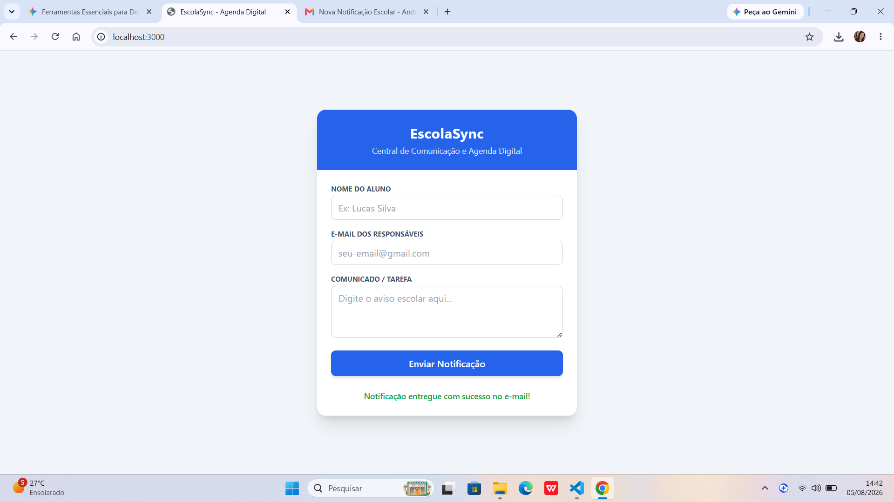
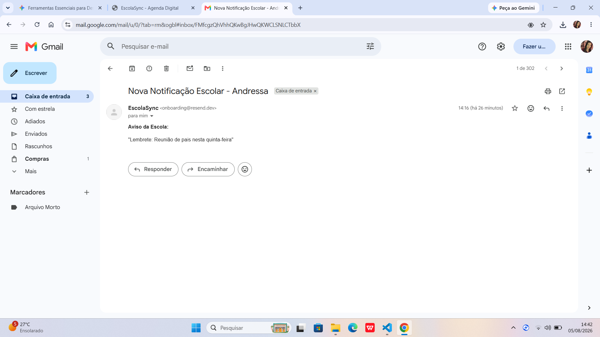

# 🏫 EscolaSync - Agenda Digital & Central de Comunicação Escolar

> **Projeto de Portfólio para Estágio em Desenvolvimento de Software**
> Solução completa para comunicação e envio de notificações automatizadas entre escola e responsáveis, focada em segurança, arquitetura leve e usabilidade.

---

## 🎯 Objetivo do Projeto

O **EscolaSync** é uma plataforma de **Agenda Digital Escolar** desenvolvida para simular e resolver o fluxo real de comunicação da **EducareBox**. O sistema permite que a instituição de ensino envie avisos, eventos e lembretes de atividades com entrega garantida e instantânea via e-mail transacional.

---

## 🛠️ Tecnologias Utilizadas & Arquitetura

O projeto foi projetado seguindo as melhores práticas de **arquitetura de software**, mantendo o código limpo, modular e altamente seguro.

| Camada / Função | Ferramenta / Tecnologia | Justificativa Técnica |
| :--- | :--- | :--- |
| **Front-end (UI)** | HTML5, Tailwind CSS, Vanilla JS | Interface responsiva, leve e sem sobrecarga de frameworks. |
| **Backend (API)** | Node.js + Express | Servidor web rápido para processar requisições e integrar serviços. |
| **Envio de Notificações** | Resend API | Serviço moderno e de alta entregabilidade para e-mails transacionais. |
| **Segurança & Variáveis** | `dotenv` + `.gitignore` | Isolamento de chaves privadas e credenciais contra vazamentos. |
| **Gestão & UX** | Notion, Figma & Jira | Planejamento de requisitos, prototipagem e controle de tasks em Kanban. |

---

## 🔒 Práticas de Segurança Implementadas

1. **Proteção de Chaves de API (`.env`):** A chave do provedor de e-mail (`RESEND_API_KEY`) é armazenada exclusivamente em variáveis de ambiente no lado do servidor.
2. **Separação de Responsabilidades:** O front-end nunca se comunica diretamente com a API do Resend, prevenindo que usuários mal-intencionados inspecionem requisições para extrair credenciais.
3. **Controle de Versão Seguro (`.gitignore`):** O arquivo `.gitignore` previne o envio de credenciais e dependências pesadas (`node_modules/`) para o GitHub.

---

## 📁 Estrutura de Arquivos do Projeto

```text
escola-sync/
├── public/
│   └── index.html      # Interface da Agenda Digital (HTML + Tailwind)
├── .env                # Variáveis de ambiente e chaves privadas (Seguro)
├── .gitignore          # Filtro do Git para ignorar arquivos sensíveis
├── package.json        # Dependências e scripts do Node.js
└── server.js           # API Serverless em Express + Resend API
---

## 🚀 Como Executar o Projeto Localmente

### Pré-requisitos
* **Node.js** instalado (v18 ou superior)
* Conta criada na plataforma **Resend** (para emissão da API Key)

### Passo a Passo

1. **Clonar / Baixar o repositório:**
   ```bash
   git clone https://github.com/minaandressa2-max/escola-sync.git
   ```

2. **Instalar as dependências:**
   ```bash
   npm install
   ```

3. **Configurar as Variáveis de Ambiente:**
   Crie um arquivo `.env` na raiz do projeto e adicione suas credenciais:
   ```env
   PORT=3000
   RESEND_API_KEY=sua_chave_do_resend_aqui
   ```

4. **Iniciar o Servidor:**
   ```bash
   node server.js
   ```

5. **Acessar no Navegador:**
   Navegue para `http://localhost:3000`

---

## 📸 Demonstração e Evidências

## 📸 Interface Web da Agenda Digital



## 📧 E-mail Recebido


---

## 👨‍💻 Desenvolvido por
**Andressa Mina Martins dos Anjos**  
*Candidato à vaga de Estágio em Desenvolvimento de Software - EducareBox*
